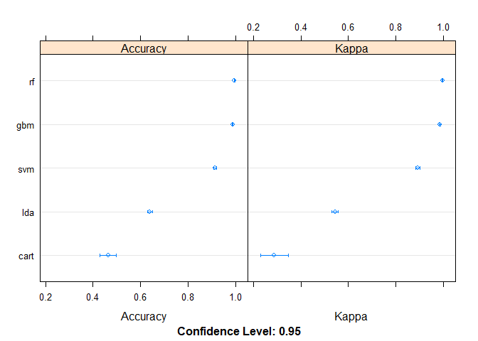

## Synopsis

Human Activity Recognition Machine Learning Prediction Project

Human Activity Recognition - HAR - has emerged as a key research area in the last years and is gaining increasing attention by the pervasive computing research community (see picture below, that illustrates the increasing number of publications in HAR with wearable accelerometers), especially for the development of context-aware systems. There are many potential applications for HAR, like: elderly monitoring, life log systems for monitoring energy expenditure and for supporting weight-loss programs, and digital assistants for weight lifting exercises. In this classification project different algos are used to predict the correct 'classe' factor variable value in this course assignment. The winning model fit is very accurate, so that we are confident to be able to predict all 20 cases correctly.

## Data & io

This dataset with 5 classes (sitting-down, standing-up, standing, walking, and sitting) was collected on 8 hours of activities of 4 healthy subjects. 

The data for this project come from this source: http://web.archive.org/web/20161224072740/http:/groupware.les.inf.puc-rio.br/har. If you use the document you create for this class for any purpose please cite them as they have been very generous in allowing their data to be used for this kind of assignment.

```r
options(scipen=999)
if(!exists('training')) {
    training <- read.table("pml-training.csv", comment.char = "#", 
                  header = TRUE, sep = ",", na.strings = c("NA","NaN","","#DIV/0!"))
}

if(!exists('testing')) {
    testing <- read.table("pml-testing.csv", comment.char = "#", 
                  header = TRUE, sep = ",", na.strings = c("NA","NaN","","#DIV/0!"))
}
```

## Data Wrangling & Munching


```r
training.lean <- training

# remove na from training factor variables
i <- sapply(training.lean, is.factor) # Identify all factor variables in your data
training.lean[i] <- lapply(training.lean[i], as.character) # Convert factors to character variables
training.lean[is.na(training.lean)] <- 0 # Replace NA with 0
training.lean[i] <- lapply(training.lean[i], as.factor) # Convert character columns back to factors

testing.lean <- testing

# remove na from testing factor variables
i <- sapply(testing.lean, is.factor) # Identify all factor variables in your data
testing.lean[i] <- lapply(testing.lean[i], as.character) # Convert factors to character variables
testing.lean[is.na(testing.lean)] <- 0 # Replace NA with 0
testing.lean[i] <- lapply(testing.lean[i], as.factor) # Convert character columns back to factors

# remove predictors with low variation as more than 19K rows are zero
zero <- function(x) sum(x == 0) > 19000
num <- c(t((numcolwise(zero)(training.lean))))
training.lean <- training.lean[,!num]
testing.lean <- testing.lean[,!num]

#remove first 6 columns as these are soley circumstantial and not able to predict the classe outcome
training.lean <- training.lean[,7:60]
testing.lean <- testing.lean[,7:60]

#sapply(training.lean, function(x) sum(is.na(x)))
```

## Data Partitioning


```r
# create a list of 80% of the rows in the original dataset we can use for training
validation_index <- createDataPartition(training.lean$classe, p=0.80, list=FALSE)
# select 20% of the data for validation
data.val <- training.lean[-validation_index,]
# use the remaining 80% of data to training and testing the models
data.train <- training.lean[validation_index,]

# training predictors and outcome separated
x <- data.train[, names(data.train) != "classe"]
y <- data.train[,c('classe')]
```

## EDA

it is difficult to plot with so many variables, we waive to plot anything and instead get a feeling for the frequency of each classe factor.


```r
levels(data.train$classe)
```

```
## [1] "A" "B" "C" "D" "E"
```

```r
table(data.train$classe )
```

```
## 
##    A    B    C    D    E 
## 4464 3038 2738 2573 2886
```

```r
table(data.val$classe )
```

```
## 
##    A    B    C    D    E 
## 1116  759  684  643  721
```

## Validation concept

We go for 10-fold cross-validation to estimate the accuracy by resampling 10 times.
This will divide our data set into 10 parts, train in 9 and test on 1. 
We waive to have repeated cross validation runs in order to reduce running time.
The metric will always be Accuracy.


```r
# Run algorithms using 10-fold cross validation
crtl <- trainControl(method="cv", number=10)
metric <- "Accuracy"
```


## Algorithm choice

We pick five different Algorithms from the PML studies for this classification task from linear to  complex nonlinear types.


```r
library(caret)

set.seed(88)
# Linear discriminant Analysis
fit.lda <- train(classe~., data=data.train, method="lda", metric=metric, trControl=crtl)

set.seed(88)
# CART
fit.cart <- train(classe~., data=data.train, method="rpart", metric=metric, trControl=crtl)

set.seed(88)
# boost gbm
fit.gbm <- train(classe~., data=data.train, method="gbm", metric=metric, trControl=crtl, verbose=FALSE)

set.seed(88)
# SVM
fit.svm <- train(classe~., data=data.train, method="svmRadial", metric=metric, trControl=crtl)

set.seed(88)
# Random Forest
fit.rf <- train(classe~., data=data.train, method="rf", metric=metric, trControl=crtl)
```


```r
# summarize accuracy of models
results <- resamples(list(lda=fit.lda, cart=fit.cart, gbm=fit.gbm, svm=fit.svm, rf=fit.rf))
summary(results)
```

```
## 
## Call:
## summary.resamples(object = results)
## 
## Models: lda, cart, gbm, svm, rf 
## Number of resamples: 10 
## 
## Accuracy 
##           Min.   1st Qu.    Median      Mean   3rd Qu.      Max. NA's
## lda  0.6118547 0.6303378 0.6383307 0.6396523 0.6509554 0.6658180    0
## cart 0.4070064 0.4221057 0.4504573 0.4638484 0.5151215 0.5181644    0
## gbm  0.9853410 0.9859783 0.9872656 0.9877697 0.9896480 0.9910885    0
## svm  0.8992989 0.9103790 0.9165335 0.9146428 0.9189234 0.9292994    0
## rf   0.9917145 0.9957022 0.9971336 0.9964966 0.9980889 0.9993631    0
## 
## Kappa 
##           Min.   1st Qu.    Median      Mean   3rd Qu.      Max. NA's
## lda  0.5094509 0.5322190 0.5417475 0.5436518 0.5574172 0.5763576    0
## cart 0.1924738 0.2138793 0.2720689 0.2882678 0.3733207 0.3781949    0
## gbm  0.9814565 0.9822607 0.9838926 0.9845293 0.9869063 0.9887293    0
## svm  0.8726386 0.8865706 0.8943429 0.8919554 0.8973476 0.9105762    0
## rf   0.9895188 0.9945636 0.9963742 0.9955685 0.9975825 0.9991944    0
```


```r
# compare accuracy of models
dotplot(results)
```

<!-- -->

```r
# summarize Best Model
print(fit.rf)
```

```
## Random Forest 
## 
## 15699 samples
##    53 predictor
##     5 classes: 'A', 'B', 'C', 'D', 'E' 
## 
## No pre-processing
## Resampling: Cross-Validated (10 fold) 
## Summary of sample sizes: 14129, 14129, 14129, 14130, 14128, 14130, ... 
## Resampling results across tuning parameters:
## 
##   mtry  Accuracy   Kappa    
##    2    0.9881520  0.9850100
##   27    0.9964966  0.9955685
##   53    0.9914640  0.9892004
## 
## Accuracy was used to select the optimal model using the largest value.
## The final value used for the model was mtry = 27.
```

## Additional Validation

use the large validation data set with its 3923 observations to check the models accuracy.


```r
predictions <- predict(fit.rf, data.val)
performance <- confusionMatrix(predictions, data.val$classe)
print(performance)
```

```
## Confusion Matrix and Statistics
## 
##           Reference
## Prediction    A    B    C    D    E
##          A 1116    0    0    0    0
##          B    0  758    1    0    0
##          C    0    0  683    0    0
##          D    0    1    0  643    0
##          E    0    0    0    0  721
## 
## Overall Statistics
##                                                
##                Accuracy : 0.9995               
##                  95% CI : (0.9982, 0.9999)     
##     No Information Rate : 0.2845               
##     P-Value [Acc > NIR] : < 0.00000000000000022
##                                                
##                   Kappa : 0.9994               
##                                                
##  Mcnemar's Test P-Value : NA                   
## 
## Statistics by Class:
## 
##                      Class: A Class: B Class: C Class: D Class: E
## Sensitivity            1.0000   0.9987   0.9985   1.0000   1.0000
## Specificity            1.0000   0.9997   1.0000   0.9997   1.0000
## Pos Pred Value         1.0000   0.9987   1.0000   0.9984   1.0000
## Neg Pred Value         1.0000   0.9997   0.9997   1.0000   1.0000
## Prevalence             0.2845   0.1935   0.1744   0.1639   0.1838
## Detection Rate         0.2845   0.1932   0.1741   0.1639   0.1838
## Detection Prevalence   0.2845   0.1935   0.1741   0.1642   0.1838
## Balanced Accuracy      1.0000   0.9992   0.9993   0.9998   1.0000
```


Very good! the RandomForest model achieves an 99.9490186% accuracy on this unseen data set, which is what he hoped for. We can conclude that this final model is not likely be overfitted and may perform well also on the official test cases.
Generally we expect an generalization error / out of sample error greater than in the sample. In this case it is -98.9490186%.

## Diagnosis

We check what predictors are of highest importance in this algorithm and if this is plausible. Also we double check again if we really all these variables are suitable and good predictors.


```r
varimportance <- varImp(fit.rf)
varimportance
```

```
## rf variable importance
## 
##   only 20 most important variables shown (out of 53)
## 
##                   Overall
## num_window        100.000
## roll_belt          48.749
## magnet_dumbbell_z  28.846
## magnet_dumbbell_y  24.822
## accel_dumbbell_y   17.043
## accel_arm_x        13.836
## magnet_dumbbell_x  13.027
## roll_arm           10.713
## accel_dumbbell_z   10.240
## accel_belt_z       10.058
## accel_forearm_x     9.750
## magnet_belt_x       9.124
## magnet_belt_y       8.660
## magnet_belt_z       8.491
## accel_forearm_z     7.232
## accel_dumbbell_x    6.612
## magnet_forearm_x    6.242
## gyros_belt_z        4.801
## magnet_forearm_z    4.449
## gyros_dumbbell_y    4.098
```

## Predictions

Now we use our RandomForest model with the assigned official test data set and its 20 observations to predict the classe for each observation for course submission.

We account for an generalization error / out of sample error greater than seen with training and validation data set.


```r
# predict 20 test case with the best model
pred.rf.testing.lean <- predict(fit.rf, testing.lean)

table(pred.rf.testing.lean)
```

```
## pred.rf.testing.lean
## A B C D E 
## 7 8 1 1 3
```

```r
print(pred.rf.testing.lean)
```

```
##  [1] B A B A A E D B A A B C B A E E A B B B
## Levels: A B C D E
```

## Reproducability

This R markdown files is complete and runnable.
However the rendering did only succeed from the console with

`library("knitr")`

`rmarkdown::render("08-PML-Course-project.Rmd")`
